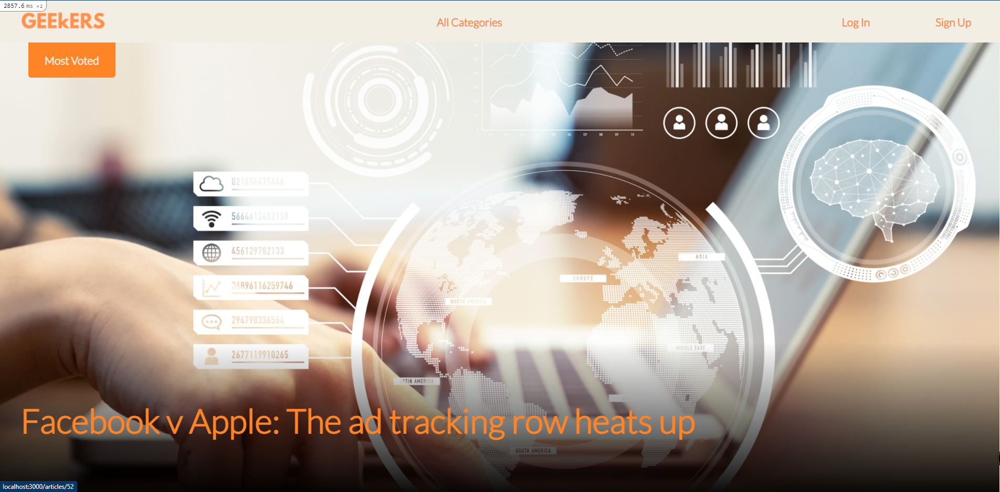

# Capstone Project for Ruby on Rails

> This is a Website based on the Lifestyle web, where you can create and vote articles, and the most voted article will be displayed on the main page of the web.

# About

> This is an app where you can create an account and then login to create articles and vote for the better ones. The main purpose of this project was to build the correct associations between the categories and the articles to show the correct content on the main page.

What you can do on the app:
- Sign up and Log in
- Create articles and see other articles from all the users
- Users can vote for all the articles

In this project I:
- Used PostgreSQL as the database
- Created advanced associations between users, articles, and categories
- Used scopes to make more efficient database queries
- Created models, views, and controllers for users, articles, and categories
- Used Rspec to test model validations and associations
- Implemented integration tests with Capybara
- Added a unique vote or unvote button for each article with a user

# Application Screenshot


## Video

You can watch this [video](https://www.loom.com/share/97983c1977874bc08f764794843fa1fd) where I am explaining all the functionality of the app.

## Built With

- Ruby v2.7.2
- Ruby on Rails v6.0.3.6
- Heroku
- PostgreSQL

## Live Demo

You can visit [here](https://fathomless-escarpment-63145.herokuapp.com/) our app.

## Getting Started

To get a local copy up and running follow these simple example steps:

- Clone this repository with:
```
    git clone --depth 1 https://github.com/alexisbec/lifestyle-articles.git
```
- Open the project folder where the repository was downloaded in your favourite editor.
- First you have to install all the yarn dependencies with:
```
    yarn install --check-files
```
- After that, you have to install all the project dependencies:
```
    bundle install
```
- Start the postgres database server and setup the database:
```
    rails db:create
    rails db:migrate
```
- Then you have to populate the app with: 
```
    rails db:seed
```
- Start the local server:
```
    rails s
```
- Now you can open your favorite web-browser and visit:
```
    http://localhost:3000
```

## Prerequisites

- Ruby v2.7.2
- Ruby on Rails v6.0.3.6
- Postgres: >=9.5

## Usage
### Heroku

- Open this [link](https://fathomless-escarpment-63145.herokuapp.com/) in your browser

### Local

- Start the server with:

```
    rails server
```
- Open `http://localhost:3000/` in your browser

### Instructions

1. Create a user in 'Sign Up'
2. Create an article
3. Check the categories available in "All Categories"
4. Check all the articles from each category
5. Vote for all your favorite articles

### Run tests

```
    rspec --format documentation
```

In this project there are two different types of tests:

- Integration Tests made with Capybara (You will need a Chrome browser for these tests to work.)
- Unit Tests made with Rspec

## Author

👤 **Alexis Varela**
- Github: [@alexisbec](https://github.com/alexisbec)
- Linkedin: [Alexis Varela](www.linkedin.com/in/alexbec)
- Twitter: [@AlexisV31667779](https://twitter.com/AlexisV31667779)


## 🤝 Contributing

Contributions, issues, and feature requests are welcome in the [issues](https://github.com/alexisbec/lifestyle-articles/issues) page.

## Show your support

Give a ⭐️ if you like this project!

## 📝 License

This project is [MIT](https://github.com/alexisbec/lifestyle-articles/blob/development/LICENSE) licensed.
